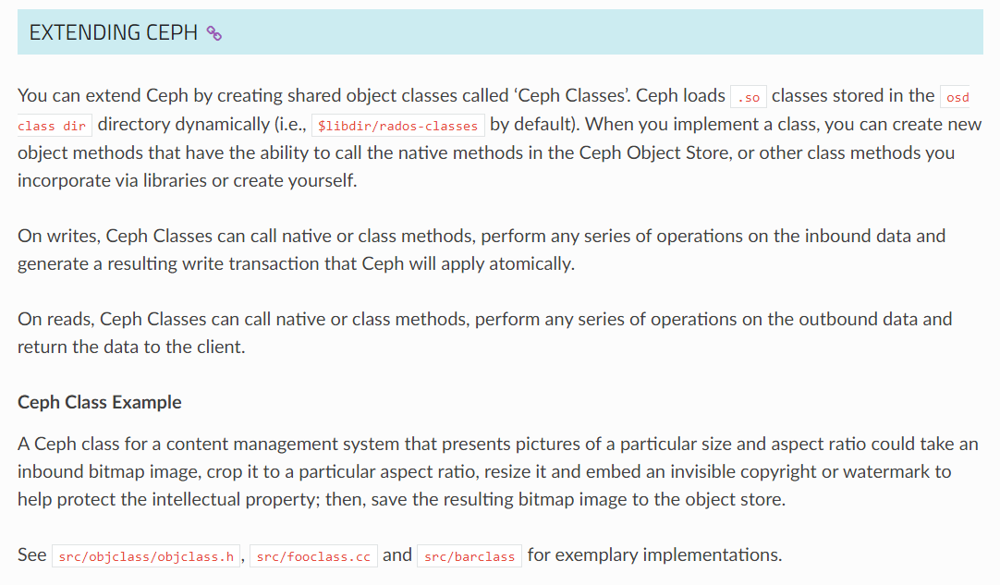
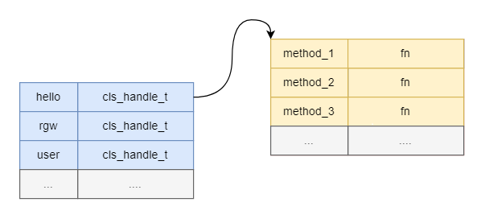

## 简介

在日常开发或者测试过程中，我们或多或少都接触过cls。那什么是cls呢？[ceph文档](https://docs.ceph.com/en/latest/architecture/#extending-ceph)给出了答案：



通俗的理解，cls就是ceph提供的一种插件机制。这样做有什么好处呢？

1. 事务支持，同一个cls中的所有写操作都归属于同一个事务。

	>  以rgw删除桶为例：
	>
	> 当我们删除指定桶时，我们需要将其从`{uid}.buckets`的OMAP中移除，并且还需要更新`{uid}.buckets`OMAP HEADER中记录的统计信息`cls_user_stats`。如果在rgw侧实现这些逻辑，将会编写很多额外的代码来处理各个阶段可能存在的错误。而使用cls来实现，由于rados提供的事务支持，我们无需进行额外的错误处理。

2. 性能

	在分布式存储中，通常情况下，CPU不太可能是性能瓶颈(主要受限于网络和磁盘IO)，因此，我们可以将部分CPU密集型业务通过cls转移到存储端运行。

	> 除此之外，cls还能降低网络带宽的占用。


## 示例

### 如何编写 cls 模块

参考`src/cls/hello/cls_hello.cc`

### 如何使用 cls 模块

1. `Ioctx.exec`

	```c++
	int librados::IoCtx::exec(const std::string& oid, const char *cls, const char *method,
														bufferlist& inbl, bufferlist& outbl);
	```

2. `ObjectOperation`

	```c++
	void librados::ObjectOperation::exec(const char *cls, const char *method, bufferlist& inbl, librados::ObjectOperationCompletion *completion);
	```


## 实现原理

如果`osd_open_classes_on_start == true`，那OSD在启动时就会加载所有的cls模块（否则，就是按需加载）。如何加载呢？

一个cls模块本质上就是一个so文件，在linux系统上，通过`dlopen`系统调用就能打开so，通过`dlsym`能查找函数名获取函数指针。

为了通用性，cls要求每一个cls模块都必须有一个固定签名的"main"函数，其定义如下：

```c++
CLS_INIT(hello)
{
  ...
}

#define CLS_INIT(name) \
CEPH_CLS_API void __cls_init()
```

这样，在`dlopen`打开so文件后，通过`dlsym`就能获取`__cls_init()`的函数指针，进而调用该函数完成cls模块的初始化。

```c++
cls->handle = dlopen(fname, RTLD_NOW);
...
void (*cls_init)() = (void (*)())dlsym(cls->handle, "__cls_init");
if (cls_init) {
  cls_init(); // 完成初始化
}
```

在hello的示例中，其初始化操作如下：

```c++
int say_hello(cls_method_context_t hctx, bufferlist *in, bufferlist *out)
{
  ...
  return 0;
}

CLS_INIT(hello)
{
  cls_handle_t h_class;
  cls_method_handle_t h_say_hello;
  
  cls_register("hello", &h_class);
  cls_register_cxx_method(h_class, "say_hello",
			  									CLS_METHOD_RD,
			  									say_hello, &h_say_hello);
  ...
}
```

`cls_register`： 注册一个cls模块，这里会将 cls模块名和`cls_handle_t`关联起来。

`cls_register_cxx_method`: 注册一个cls方法，这里会将cls 方法名和 cls函数指针(固定为`int(*fn)(cls_method_context_t *, bufferlist *, buffertlist*)`)关联起来。

在所有cls模块都加载完成后，osd的内存中将维护一个这样的内存结构：



通过指定cls模块名和cls方法名，osd最终就能获取到对应的函数指针并执行对应的函数。