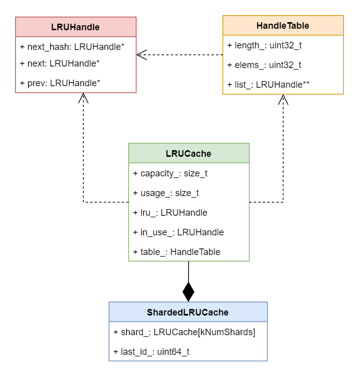
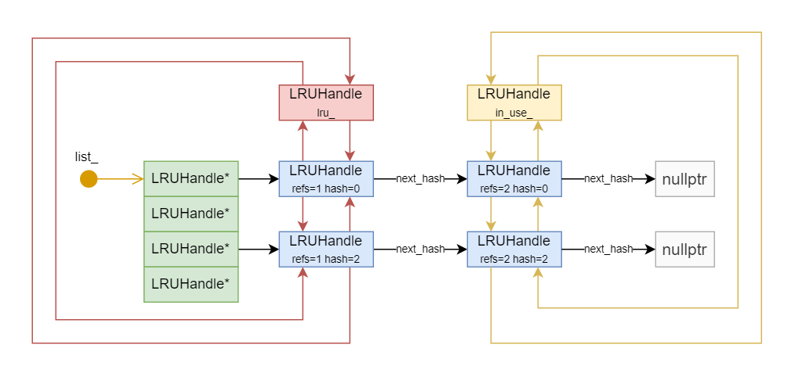

**LRUCache**

- `capacity_`

	当前`LRUCache`的总容量。默认为`8M`。

- `usage_`

	当前`LRUCache`已经使用的容量。当`usage_ > capacity_`时， 就需要淘汰掉最旧的`LRUHandle`了。

- `lru_`

	`LRUHandle::refs == 1 && in_cache == true`的`LRUHandle`都挂在该双向链表上，`refs==1`表示当前无其他clients使用该`LRUHandle`。 

	> Dummy head of LRU list. lru.prev is newest entry, lru.next is oldest entry.

- `in_use_`

	`refs >1 && in_cache == true`的`LRUHandle`都挂在该双向链表上，`refs > 1`表示有其他clients正在使用该`LRUHandle`。

	> Dummy head of in-use list.

	

**HandleTable**

- `length_`

	Hash 桶的个数

- `elems_`

	当前`HandleTable`中的元素个数

- `list_`

	指向hash桶(实际上就是一个数组，数组中的每个元素都是一个 单链表的头结点)。拥有相同hash值`LRUHandle`会挂在同一个单链表中(通过`LRUHandle::next_hash`串起来)。

为了更直观的理解上述各个类及其成员变量，请看`LRUCache`结构图：

